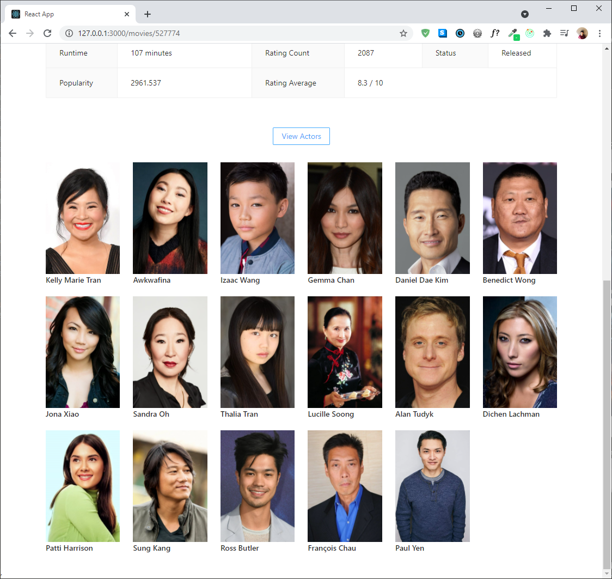

# movie-app-mern


## Description

Movie-app-mern is a web app that allows users to see the full list of the latest and most popular movies. Users can click on movies to view their specific information like casts, runtime, average rating, and revenue data. Furthermore, users can choose to 'favorite' certain movies so that they can easily oragnize and catalog movies they enjoyed watching. There is also a 'favorite-count' number on each movie page, and everyone can see how many others have favorited the movie. In order to use the favorite features, users must register for the website and sign in.

This web app was built with the MERN stack and [The Movie Database API](https://developers.themoviedb.org/3). In order to clone and use this web app, you need to have your own mongoDB URI information and TMDb API key as part of the code. The overall structure was built with [nodejs-boilerplate](https://github.com/byunsy/nodejs-boilerplate) which I made previously.

## Installation

I used node.js version 14.16.0 and npm version 6.14.11.

```bash
nvm install 14.16.0
```

```bash
nvm use 14.16.0
```

## Usage

Clone the movie-app-mern repository in your directory.

```bash
git clone https://github.com/byunsy/movie-app-mern.git
```

Create "dev.js" file in /server/config directory and insert your mongoDB information.

```bash
module.exports = {
    mongoURI: "<your_mongoDB_URI_goes_here>"
}
```

Go to the root directory and install all the requirements for the server-side.

```bash
npm install
```

Now go to the client directory and install all the requirements for the client-side.

```bash
npm install
```

You also need to have your own TMDb API key to fetch movie data. Create "key.js" file in /client/src directory and insert your API key information.

```bash
module.exports = {
  MOVIE_API: "<your_TMDb_API_key_goes_here>"
}
```

Finally, once you have all the requirements above, go back to the root directory and start the app using the command below.

```bash
npm run dev
```

## Demonstrations

### 1. Landing Page

You can see the full list of the latest and most popular movies.

<p align="center">
  
</p>

### 2. User Page

You will need to sign in to use the 'favorite' feature to create your own curated collection of movies. If you have not signed up yet, go ahead and register for the website.

|           Sign-in Page           |          Register Page           |
| :------------------------------: | :------------------------------: |
|  |  |

### 3. Movie Detail Page

Using the TMDb API, you can get access to all relevant movie information.

<p align="center">
  
</p>

And you can toggle the "View Actors" to see the full list of the cast.

<p align="center">
  
</p>

You can choose to favorite certain movies. Each movie detail page will keep track of how many users have favorited the corresponding movie. You can click the button once again to 'unfavorite' it.

<p align="center">
  
</p>

### 4. Favorite Page

In the 'My Favorite' page, you can see and edit all the movies you have favorited so far. This is the collection of movies you have favorited from the movie detail pages.

<p align="center">
  
</p>

By hovering your cursor over the title, you can quickly view the corresponding movie poster.

<p align="center">
  
</p>

You can also choose to Remove from the favorite list using the "Delete" button. This will update the favorite count value in the movie detail page.

<p align="center">
  
</p>
